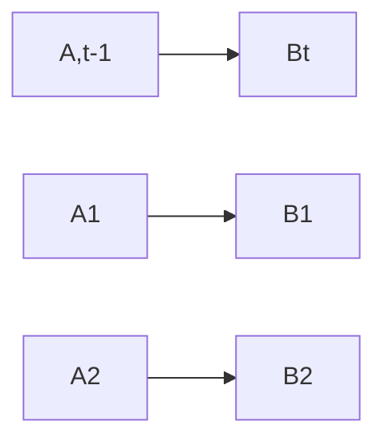
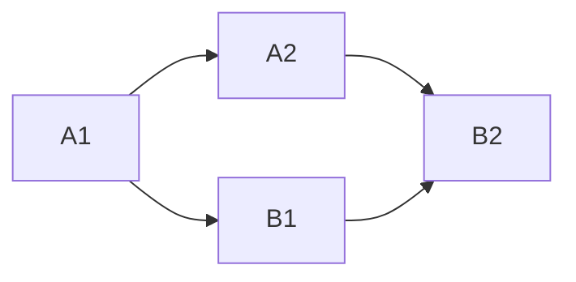

# PlaySpace Architecture

PlaySpace is an environment with networked state, that supports on the fly deployment of applications. There are several core concepts that define this environment:

* Networked state between useragents
* Timing system that state updates are calculated
* Application frameworks for developing code that can have its state easily swapped out. This also enables swapping the application out.
* System for controlling applications deployed on different clients to the platform.
* Deriving state from other state. A dependency graph is maintained, and the timing system is used to deterministically calculate the computed state nodes.
* State

Every piece of code has a state and running code

A deterministic state graph is maintained, along with the application code that derives one state from another. How this graph works over time can be thought of in two ways:
1. A continuously expanding a graph, where new nodes are created for each time step.
2. A graph with a constant set of nodes, but changing values at different time steps.
Both visualizations are valid.

Regardless of networking

Nodes must be deterministic in order to take advantage of network optimizations. Otherwise the node's computation must be manually sent from server to client.

Critic:
* Is a list of nodes beyond the non deterministic ones needed?
  * Perhaps not. The whole second layer of nodes and beyond could be refed state.

Computed nodes in this state graph should be deterministic. So

Or

